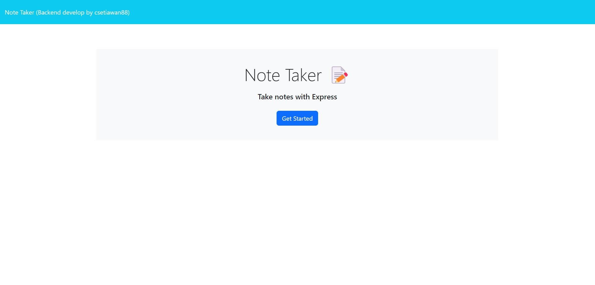
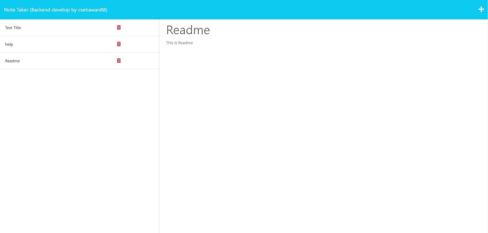

# Module 11 Challenge

# Express.js Challenge: Note Taker

## Description

My challenge is to create an application called Note Taker that can be used to write and save notes. This application will use an Express.js back end and will save and retrieve note data from a JSON file.

The application’s front end has already been created. It's my job to build the back end, connect the two, and then deploy the entire application to Heroku.

## User Story

AS A small business owner
I WANT to be able to write and save notes
SO THAT I can organize my thoughts and keep track of tasks I need to complete

## Criteria

1. GIVEN a note-taking application.
2. WHEN user open the Note Taker, THEN user presented with a landing page with a link to a notes page.
3. WHEN user click on the link to the notes page, THEN user presented with a page with existing notes listed in the left-hand column, plus empty fields to enter a new note title and the note’s text in the right-hand column.
4. WHEN user enter a new note title and the note’s text, THEN a Save icon appears in the navigation at the top of the page.
5. WHEN user click on the Save icon, THEN the new note user have entered is saved and appears in the left-hand column with the other existing notes.
6. WHEN user click on an existing note in the list in the left-hand column, THEN that note appears in the right-hand column.
7. WHEN user click on the Write icon in the navigation at the top of the page, THEN user presented with empty fields to enter a new note title and the note’s text in the right-hand column.
8. Application front end must connect to an Express.js back end.
9. Application back end must store notes with unique IDs in a JSON file.
10. Application must be deployed to Heroku.

## Completed

1. I have created back end for a note-taking application.
2. When user open the Note Taker, I have created a landing page with a link to a notes page.
3. I have added function for user to click on the link to the notes page, then user presented with a page with existing notes listed in the left-hand column, plus empty fields to enter a new note title and the note’s text in the right-hand column.
4. I have added function for user to enter a new note title and the note’s text, THEN a Save icon appears in the navigation at the top of the page.
5. I have added function for user to click on the Save icon, THEN the new note user have entered is saved and appears in the left-hand column with the other existing notes.
6. I have added function for user to click on an existing note in the list in the left-hand column, THEN that note appears in the right-hand column.
7. I have added function for user to click on the Write icon in the navigation at the top of the page, THEN user presented with empty fields to enter a new note title and the note’s text in the right-hand column.
8. I have created application front end to connect to an Express.js back end.
9. I have created application back end to store notes with unique IDs in a JSON file.
10. I have created application deployed to Heroku.

## Install & Run the Application

1. Navigate to the develop folder using the command prompt.
2. Run `npm install` to install all dependencies.
3. To run the application locally, run `node server.js` in your command prompt.
4. And then open `http://localhost:8888` in your browser.
5. To end your server in your command prompt type: Ctrl + c
6. Else click deployed site (HEROKU): https://sheltered-depths-14099-b835c02a59f9.herokuapp.com/notes

## Screenshot

#### Note Taker

## Repository & URL - Link

GITHUB: https://github.com/csetiawan88/notetaker

URL: https://sheltered-depths-14099-b835c02a59f9.herokuapp.com/notes

## Technologies

- [Express.js](https://expressjs.com/)
- [Heroku](https://www.heroku.com/)
- [Node.js](https://nodejs.org/)
- [Inquirer.js](https://www.npmjs.com/package/inquirer)
- [Bootstrap](https://getbootstrap.com/)
- [NPM](https://www.npmjs.com/)
- HTML
- CSS
